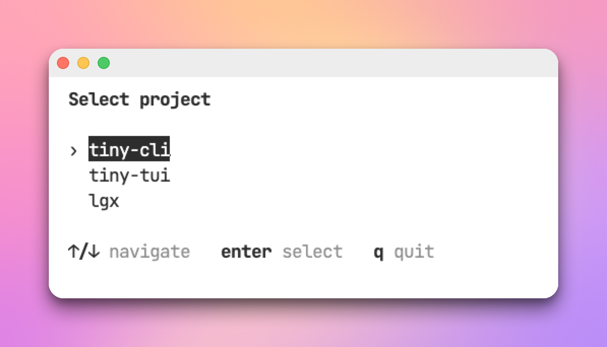
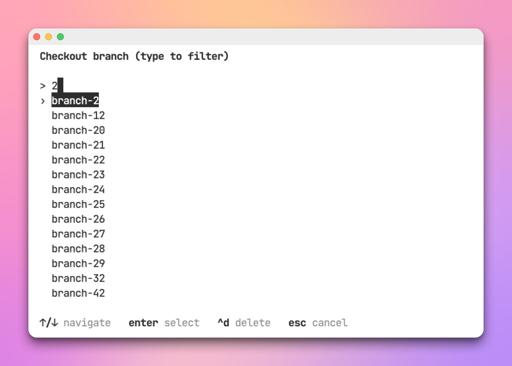
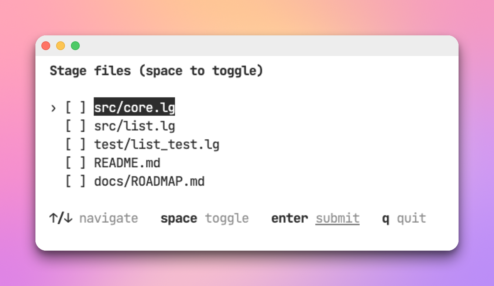
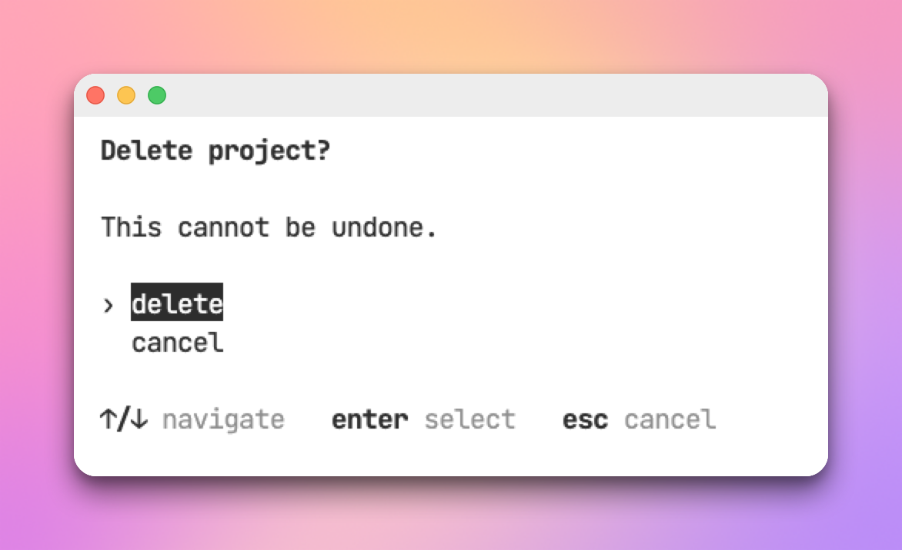
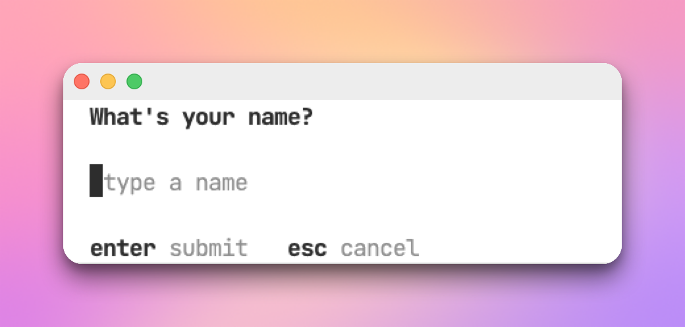

# tiny-tui

A small terminal UI library for [let-go](https://github.com/nooga/let-go). It
adds interactive bits to command-line tools: pick an item from a
list, filter it, run actions on it, confirm a step, read a line of text.

## Install

Add tiny-tui to your project's `lgx.edn` and run `lgx install`:

```clojure
;; lgx.edn
{:deps {tiny-tui {:git/url "https://github.com/abogoyavlensky/tiny-tui"
                  :git/tag "<TAG>"}}}
```

## Quick start

```clojure
(ns mytool.main
  (:require [tiny-tui.core :as tui]))

(let [res (tui/select {:title "Select project"
                       :items [{:name "tiny-cli"} {:name "tiny-tui"} {:name "lgx"}]
                       :item->text :name})]
  (case (:type res)
    :select (println "Selected" (:name (:item res)))
    :cancel nil))
```

```
lgx run main.lg
```



`select` runs until the user picks an item or cancels, then returns an event
map. Long lists scroll on their own. Turn on `:filterable?` to type-to-filter,
`:multi?` for checkboxes, or `:on-action` to act without leaving the list. All
are options on the one function, described below.

## Reference

Entry points live in `tiny-tui.core` (aliased `tui` here). Every one accepts
`:inline?` and the testing hooks; both are described at the end.

### select

`(tui/select opts) -> event-map`

Shows a navigable list and returns how the user left it.

Options:

- `:items` - the collection to show.
- `:item->text` - `(fn [item] string)` rendering each row (default `str`).
- `:title` - a bold heading above the list.
- `:cursor-item` - start the cursor on the row equal to this item (else the
  top); handy for re-entering focused on a just-added item.
- `:status` - a seed status line shown until the first key; e.g. feedback
  carried in from a prior action.
- `:actions` - per-item commands (see [Actions](#actions)).
- `:filterable?` - let the user type to narrow the list, matching a
  case-insensitive substring of the row text.
- `:filter-fn` - `(fn [query item] boolean)` replacing the default match.
- `:multi?` - checkbox mode: space toggles, enter submits (see
  [multi-select](#multi-select)).
- `:on-action` - handle an action in place and keep browsing (see [Staying in
  the loop](#staying-in-the-loop-on-action)).

Return value, dispatched on `:type`:

- `{:type :select :item i :index n}` - enter.
- `{:type :action :action id :item i :index n}` - an action key, plus
  `:confirmed? true` after a confirmation and `:destructive? true` when set.
- `{:type :submit :items [...] :indices [...]}` - enter under `:multi?`.
- `{:type :cancel}` - q, esc, Ctrl-C, or end of input.

Keys: arrows move, enter selects, q or esc cancels. Under `:filterable?`,
letters build the query and only esc cancels, so bind actions to control keys
(`:key :ctrl-d`) to keep them reachable. Under `:multi?`, space toggles the
row and enter submits the set.

Filterable select example:



### Actions

An action is a command the user runs on the highlighted item. List them in
`:actions`, each a map:

- `:id` - keyword echoed back in the event.
- `:key` - the trigger, a string (`"d"`) or keyword (`:ctrl-d`, shown as `^d`).
- `:label` - text for the help line.
- `:destructive?` or `:confirm?` - open a yes/no confirmation first.
- `:confirm-title`, `:confirm-message` - the confirmation text; the message
  may be a `(fn [item] string)`.
- `:returns?` - even under `:on-action`, return this action's event (exit
  `select`) instead of handling it in place — for work that must happen
  outside the loop, e.g. prompt for input, create something, then re-enter.

```clojure
(tui/select
 {:title "Dependencies" :items deps :item->text :name
  :actions [{:id :open :key "o" :label "open"}
            {:id :delete :key "d" :label "delete" :destructive? true
             :confirm-message (fn [d] (str "Remove " (:name d) "?"))}]})
```

### Staying in the loop (`:on-action`)

By default an action ends `select`. Add `:on-action` to handle it in place and
keep browsing:

```clojure
(let [deps (atom initial)]
  (tui/select
   {:items @deps :item->text :name
    :actions [{:id :remove :key "d" :label "remove" :destructive? true}]
    :on-action (fn [ev]
                 (swap! deps remove-item (:item ev))
                 {:items @deps :status (str "Removed " (:name (:item ev)))})}))
```

The handler receives the (confirmed) action event and returns
`{:items new-items :status "..."}`; both keys are optional. `:items` replaces
the list in place, keeping the cursor and filter, and `:status` shows one line
until the next keypress. Enter and cancel still exit. The handler is your code
and may be impure; the widgets stay pure.

### multi-select

`(tui/multi-select opts) -> [chosen items]` or `nil`

A checkbox list: space toggles the row, enter submits. Returns the chosen
items in list order, `nil` on cancel, or `[]` on an empty submit. Takes the
same options as `select` and composes with `:filterable?`.

```clojure
(tui/multi-select {:title "Stage files" :items files :item->text :name})
```



### confirm

`(tui/confirm opts) -> boolean`

Asks a yes/no question. Returns `true` only when the user confirms; y or enter
accept, n/esc/q/Ctrl-C decline.

```clojure
(when (tui/confirm {:title "Delete project?" :message "This cannot be undone."})
  (delete-project!))
```

Options: `:title`, `:message`, `:confirm-label`, `:cancel-label`.



### input

`(tui/input opts) -> string` or `nil`

Reads one line of text. Returns the string on enter, `nil` on cancel.
Left/right/home/end move the cursor and backspace/delete edit. Word keys:
Option/Alt+← and +→ (or Ctrl+← / Ctrl+→) jump by word, Option+Backspace or
Ctrl-W deletes the word before the cursor, and Alt+d (or Ctrl+Delete) the word
after it. A word is a run of ASCII letters and digits, so `.agents/skills`
jumps and deletes per path segment.

```clojure
(tui/input {:title "New name" :placeholder "type a name"
            :validate (fn [t] (when (empty? t) "Name can't be empty"))})
```

Options:

- `:title`, `:placeholder`.
- `:value` - initial text.
- `:validate` - `(fn [text] error-string-or-nil)`. A non-nil result blocks
  submit and shows a red line until the next edit.
- `:suggest-fn` - `(fn [text] [candidate-strings])`. Turns the field into an
  autocomplete: after every text change (including the initial `:value`) the
  candidates are recomputed, capped at five, and listed below the field. Tab
  replaces the text with the highlighted candidate; ↑/↓ move the highlight;
  enter still submits the current text. Each candidate is a full replacement
  for the whole field, not a fragment. The fn is your (possibly impure) code
  and should be total - return `[]` rather than throw.

For filesystem paths, `tiny-tui.path/suggest-fn` is ready-made:

```clojure
(require '[tiny-tui.path :as path])

(tui/input {:title "Install skills to"
            :value ".agents/skills"
            :suggest-fn (path/suggest-fn {:dirs-only? true})})
```

`(path/suggest-fn opts)` lists the directory implied by the typed text
(expanding a leading `~/`), matching names case-sensitively by prefix and
hiding dotfiles unless the prefix starts with `.`. Directory candidates get a
trailing `/` so accepting one and typing again descends into it. `opts`:
`:dirs-only?` restricts candidates to directories. It never throws - a missing,
non-directory, or unreadable target yields `[]`. (The pure `path/split-input`
and `path/candidates` underneath are unit-testable with injected entries.)



### run

`(tui/run opts) -> [final-state event]`

The program loop the widgets build on. An app is three functions:

```clojure
(tui/run
 {:init  {:count 0}
  :update (fn [state msg]
            (case msg
              :up [(update state :count inc) nil]
              "q" [state :quit]
              [state nil]))
  :view  (fn [state] (str "Count: " (:count state)))})
```

`:update` returns `[next-state event]`. A nil event keeps the loop running;
any other value stops it and becomes `run`'s return event. `:view` returns the
string to draw. Messages are keywords for special keys (`:up :down :left
:right :enter :esc :backspace :delete :home :end`; `:word-left :word-right
:backspace-word :delete-word` for the word keys; and `:ctrl-x` for control
keys) and one-character strings for printable keys. The loop handles Ctrl-C,
resize, raw mode, the alternate screen, and cleanup on exceptions, and adds
`:tui/size` (a `[cols rows]` vector) to the state before each `:view`.

### Inline mode

By default a widget takes over the alternate screen. Pass `:inline? true` to
any entry point to draw at the cursor instead (gum/fzf style) and erase the
widget on exit, so your next `println` lands where it was. Use it for small
pickers; a widget taller than the terminal cannot scroll back, so keep the
default for large UIs.

### Inline sessions

Per-widget `:inline?` enters and leaves raw mode for each widget, so chaining
several flickers, and a prompt nested inside an `:on-action` handler would tear
down the outer widget. Wrap the whole flow in `tui/with-inline-session`
instead: one raw-mode span that every widget shares, rendering in place and
erasing itself as the next appears. Inside a session no per-widget `:inline?`
is needed.

```clojure
(let [items (atom ["write docs" "fix bug"])   ; string items (default :item->text)
      picked (tui/with-inline-session
               (tui/select
                {:title "Tasks" :items @items
                 :actions [{:id :rename :key "r" :label "rename"}]
                 ;; a prompt nested in the handler renders over the select,
                 ;; erases itself, and the select repaints — no :returns? dance
                 :on-action (fn [ev]
                              (let [name (tui/input {:title "Rename"
                                                     :value (:item ev)})]
                                (swap! items assoc (:index ev) name)
                                {:items @items :status (str "Renamed to " name)}))}))]
  ;; Print AFTER the session: a println inside it runs in raw mode, where a
  ;; bare \n won't return the carriage.
  (println "Picked:" picked))
```

See `examples/inline_flow.lg` for a full select → nested rename → confirm flow.

### Testing hooks

Every entry point accepts `:screen false`, `:read-key-fn`, and `:render-fn`,
so you can drive a whole flow without a terminal:

```clojure
(tui/select {:items items :item->text :name
             :screen false
             :read-key-fn (fn [] :down)   ; or a scripted sequence
             :render-fn (fn [_] nil)})
```

See `test/tiny_tui/core_test.lg` for the scripted-key pattern.

## Layout and style

`tiny-tui.layout` assembles strings; nothing here touches the terminal.

- `(columns rows)` / `(columns sep rows)` - align rows of cells into columns,
  padding each to its widest visible cell. Returns a vector of row strings.
- `(vstack & blocks)` - stack blocks top to bottom.
- `(hstack xs)` / `(hstack sep xs)` - join cells on one line (default two
  spaces).
- `(pad s w)` - right-pad `s` to visible width `w`.
- `(box content)` - draw a border around the content.

Build a tabular list by aligning once, then pointing `:item->text` at the line:

```clojure
(let [lines (layout/columns (map (fn [d] [(:name d) (:version d)]) deps))
      items (map (fn [d line] (assoc d :row line)) deps lines)]
  (tui/select {:items items :item->text :row}))
;;  › org.clojure/data.json  2.5.1
;;    lambdaisland/uri       1.19.155
```

`tiny-tui.style` wraps text in ANSI codes and measures it.

- `(bold s)`, `(dim s)`, `(inverse s)`, `(fg color s)`, `(bg color s)`.
- `(styled {:bold? :dim? :inverse? :fg :bg} s)` - several attributes at once.
- `(strip s)`, `(visible-width s)` - drop the codes, or measure display width.
- Colors are named keywords (`:red :green :yellow :blue :magenta :cyan :white
  :black`, each with a `:bright-` variant) or an integer for 256-color.

## How it works

A widget is two pure functions: `update` maps `[state message]` to
`[new-state event]`, and `view` maps `state` to a string. The loop reads a
key, calls `update`, and draws `view`. Only `tiny-tui.screen` and
`tiny-tui.key/read` touch the terminal, so scripted keys drive every flow in a
test.

Namespaces: `core` (the entry points), `list`/`confirm`/`input` (widgets),
`style`/`layout`/`help` (string rendering), `screen`/`key` (terminal I/O).

## Examples

```bash
lgx run examples/hello_screen.lg    # enter/leave the terminal
lgx run examples/static_screen.lg   # styled static screen
lgx run examples/counter.lg         # interactive counter
lgx run examples/select_project.lg  # tui/select
lgx run examples/viewport_select.lg # long list with a scroll window
lgx run examples/filter_select.lg   # type-to-filter select
lgx run examples/deps_manager.lg    # delete-in-place with :on-action
lgx run examples/multi_select.lg    # multi-select with checkboxes
lgx run examples/columns_select.lg  # aligned tabular select (layout/columns)
lgx run examples/inline_select.lg   # tui/select, inline (no alternate screen)
lgx run examples/inline_flow.lg     # chained select → nested prompt → confirm in one session
lgx run examples/confirm_delete.lg  # tui/confirm
lgx run examples/input_name.lg      # tui/input with validation
lgx run examples/input_path.lg      # tui/input with path autocomplete
lgx run examples/deps_actions.lg    # actions + confirmation
```

## Projects using tiny-tui

- [skl](https://github.com/abogoyavlensky/skl) - a minimal CLI tool to fetch and install agent skills
- [wtr](https://github.com/abogoyavlensky/wtr) - an interactive mode in a small tool to manage multiple git worktrees

## Development

Install dependencies with [mise](https://mise.jdx.dev/getting-started.html)
(or manually, from `.mise.toml`):

```bash
mise trust && mise install
```

Common commands:

```bash
lgx --help
lgx run    # select demo (main.lg)
lgx test
lgx fmt
```
